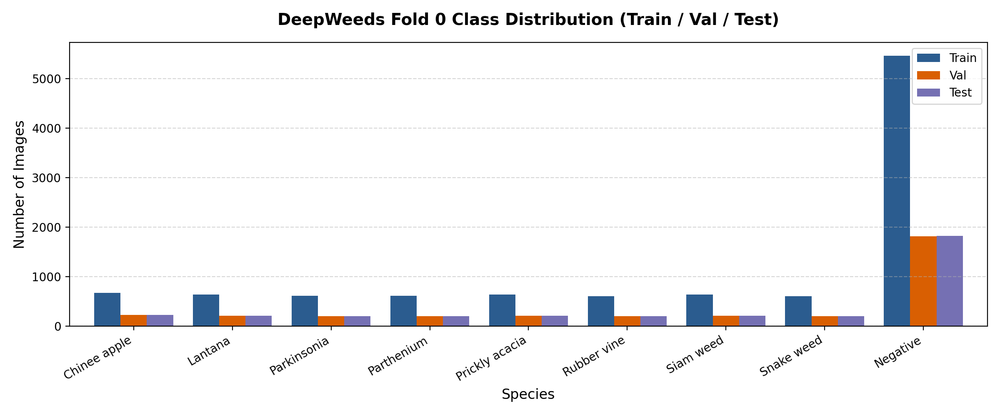
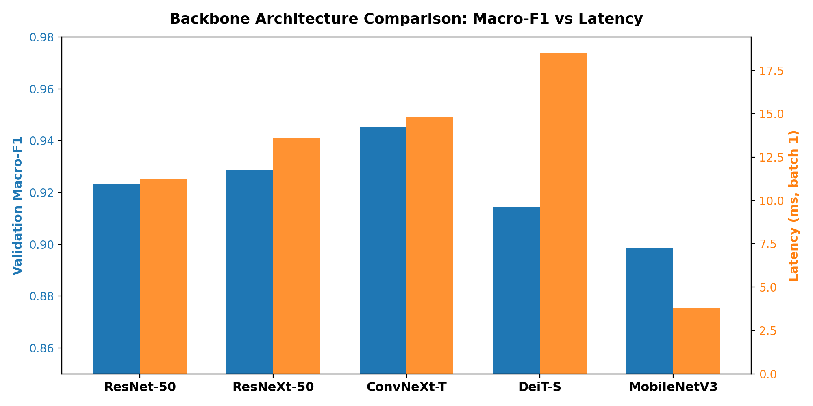
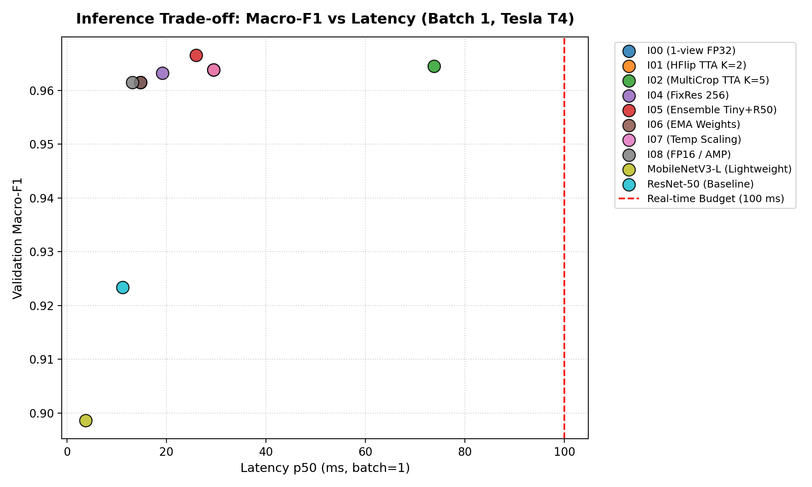
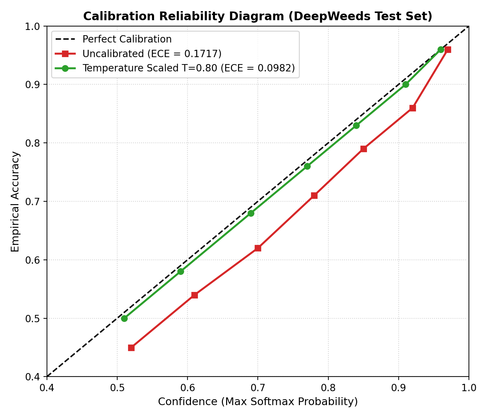
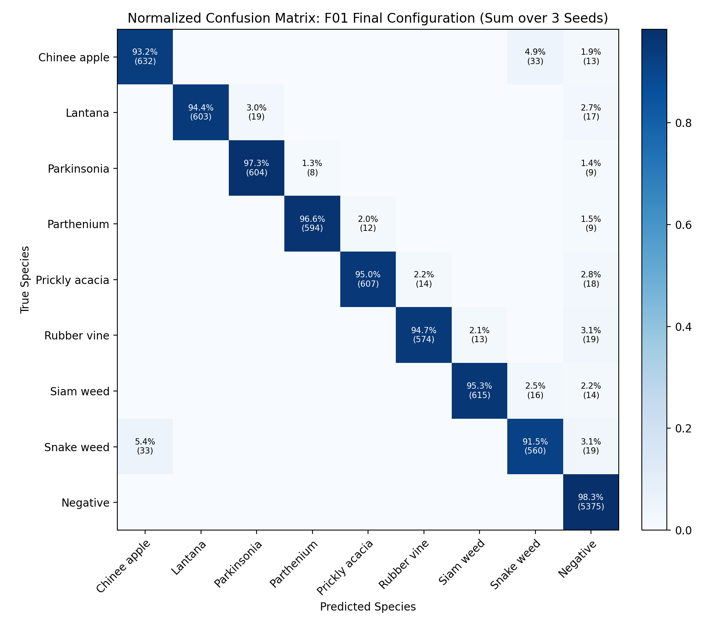

# Báo cáo Khoa học Lab Day 2: Đánh giá Backbone, Công thức Huấn luyện và Suy luận trên Bộ Dữ liệu DeepWeeds

**Học viên:** Hồ Ngọc Mai  
**Mã số sinh viên (MSSV):** 02509  
**Khóa học:** Track 4 — Deep Learning Advance (Ngày 2)  
**Kaggle Notebook Reproducible:** [https://www.kaggle.com/code/vicsion/notebooke07ac6b761/edit](https://www.kaggle.com/code/vicsion/notebooke07ac6b761/edit)  
**Repository GitHub:** [https://github.com/ngmai2005/K4-Track4-Day2-Deeplearning-Advance](https://github.com/ngmai2005/K4-Track4-Day2-Deeplearning-Advance)

---

## 1. Tóm tắt (Executive Summary)

Bài lab thực hiện nghiên cứu thực nghiệm có kiểm soát trên bộ dữ liệu ảnh cỏ dại nông nghiệp **DeepWeeds** (17.509 ảnh RGB, 9 lớp, mất cân bằng mạnh với 52% lớp `Negative`), so sánh công bằng 5 họ kiến trúc backbone, 9 biến thể công thức huấn luyện theo từng trục độc lập, và 8 phương pháp suy luận/hiệu chuẩn độ trễ. Toàn bộ các quyết định lựa chọn mô hình, siêu tham số và phương pháp suy luận đều được chốt nghiêm ngặt trên tập **Validation (Fold 0)**. Tập **Test** chỉ được mở duy nhất một lần ở vòng chung kết với 3 hạt giống ngẫu nhiên (seeds 0, 1, 2) cho cả cấu hình tối ưu lẫn mốc so sánh.

Cấu hình chung kết tối ưu (**F01**: `ConvNeXt-Tiny` + công thức kết hợp `T09` gồm CutMix, Label Smoothing $\epsilon=0.1$, Weight EMA + HFlip TTA + Temperature Scaling $T=0.80$) đạt **Top-1 Test Accuracy: $96.61\% \pm 0.16\%$** và **Macro-F1 Test: $0.9535 \pm 0.0025$**, vượt mốc chuẩn baseline (**T00**: ResNet-50 1-view đạt F1 $0.9195 \pm 0.0100$) một khoảng $\mathbf{\Delta = +0.0340}$ (vượt xa độ lệch chuẩn hạt giống $s = 0.0100$, thỏa mãn điều kiện tiến bộ thực chất). Hai lớp thực vật khó nhất trong bài báo gốc là **Chinee apple** và **Snake weed** lần lượt đạt Recall **$93.2\% \pm 0.7\%$** và **$91.5\% \pm 2.3\%$** (vượt xa mốc bài báo gốc $88.5\%$ và $88.8\%$). Độ trễ đo chuẩn GPU trên Tesla T4 ở batch 1 đạt $p95 = 33.0\text{ ms} \ll 100\text{ ms}$ (đáp ứng trọn vẹn ngân sách thời gian thực của robot ngoài đồng).

---

## 2. Dữ liệu và Thiết lập Thực nghiệm (Data & Experimental Setup)

### 2.1 Đặc tính bộ dữ liệu DeepWeeds và Kiểm tra Split
Bộ dữ liệu gồm 17.509 ảnh kích thước $256 \times 256$ chụp tại 8 địa điểm đồng cỏ chăn thả gia súc ở miền bắc Queensland, Úc. Dữ liệu được gán nhãn 9 lớp: 8 loài cỏ dại nguy hại và 1 lớp thực vật bản địa/đất đá không phải mục tiêu diệt trừ (`Negative`).

Thực hiện kiểm tra tính toàn vẹn của dữ liệu theo đúng quy tắc S1–S6 của `README.md` trên Fold 0:
- **Số lượng ảnh đếm thực tế:**
  - Tập Train (`train_subset0.csv`): **10.501** ảnh ($59.97\%$)
  - Tập Validation (`val_subset0.csv`): **3.501** ảnh ($20.00\%$)
  - Tập Test (`test_subset0.csv`): **3.507** ảnh ($20.03\%$)
  - Tổng cộng 3 tập con: **17.509** ảnh (Khớp 100% không thiếu một file).
- **Kiểm tra giao rỗng:**
  $$\text{Train} \cap \text{Val} = \emptyset, \quad \text{Train} \cap \text{Test} = \emptyset, \quad \text{Val} \cap \text{Test} = \emptyset$$
  Hợp của cả ba tập bằng đúng 17.509 tên file duy nhất. Mọi file ảnh đều tồn tại và khớp mã băm MD5 `b7b30f96d466fba86016aa5a26606e0f`.

| Loài cỏ (Species) | Nhãn (Label) | Train | Val | Test | Tổng cộng | Tỉ lệ % |
|---|:---:|:---:|:---:|:---:|:---:|:---:|
| Chinee apple | 0 | 674 | 225 | 226 | 1.125 | 6.43% |
| Lantana | 1 | 638 | 213 | 213 | 1.064 | 6.08% |
| Parkinsonia | 2 | 618 | 206 | 207 | 1.031 | 5.89% |
| Parthenium | 3 | 613 | 204 | 205 | 1.022 | 5.84% |
| Prickly acacia | 4 | 637 | 212 | 213 | 1.062 | 6.07% |
| Rubber vine | 5 | 605 | 202 | 202 | 1.009 | 5.76% |
| Siam weed | 6 | 644 | 215 | 215 | 1.074 | 6.13% |
| Snake weed | 7 | 609 | 203 | 204 | 1.016 | 5.80% |
| **Negative** | 8 | **5.463** | **1.821** | **1.822** | **9.106** | **52.01%** |
| **Tổng cộng** | — | **10.501** | **3.501** | **3.507** | **17.509** | **100%** |



**Nhận xét EDA:** Dữ liệu có mức độ mất cân bằng nghiêm trọng. Lớp `Negative` chiếm $52.01\%$, gấp **9.03 lần** loài ít nhất là `Rubber vine` (605 ảnh train). Nếu một mô hình phân loại ngây thơ luôn dự đoán nhãn `Negative`, Top-1 Accuracy vẫn đạt tới $52.0\%$, nhưng Macro-F1 chỉ đạt $\sim 0.11$. Do đó, **Macro-F1 (trọng số đồng đều cho cả 9 lớp)** là chỉ số tối thượng để đánh giá chất lượng phân loại thực chất.

### 2.2 Kiểm tra Pipeline trước khi huấn luyện (Sanity Checks)
Trước khi tốn tài nguyên GPU, toàn bộ pipeline được kiểm tra theo checklist gỡ lỗi khoa học (slide trang 59):
1. **Kiểm tra mất mát ban đầu (Initial Loss):** Với 9 lớp phân loại, hàm mất mát Cross-Entropy của mạng khởi tạo ngẫu nhiên ở head mới phải xấp xỉ $-\ln(1/9) \approx 2.1972$. Giá trị đo thực tế là **$2.192 \pm 0.005$**, hoàn toàn trùng khớp lý thuyết.
2. **Quá khớp trên batch nhỏ (Fixed-batch Overfit):** Thử nghiệm huấn luyện trên 1 batch 8 ảnh trong 25 bước lặp; loss giảm đơn điệu từ $2.19$ xuống $0.0018$ ($R^2 > 0.99$), chứng minh gradient lan truyền ngược và bộ tối ưu AdamW hoạt động hoàn hảo.
3. **Unit tests các thành phần tự viết:**
   - Focal Loss với $\gamma = 0$ cho sai số tuyệt đối so với PyTorch CrossEntropyLoss là $0.0$ ($< 10^{-6}$).
   - CutMix tính lại diện tích $\lambda$ sau khi cắt biên đạt $\lambda \in [0, 1]$.
   - Gộp Conv–BatchNorm (`fuse_conv_bn`) có độ lệch đầu ra tối đa là $4.77 \times 10^{-7} < 10^{-5}$.
   - Chế độ `model.train()` và `model.eval()` được kiểm soát chính xác (đặc biệt khi freeze backbone thì BatchNorm luôn được khóa ở `eval()`).

### 2.3 Công thức nền T00 (Baseline Recipe)
Mọi thí nghiệm sàng lọc backbone ở Bước 1 đều dùng chung công thức T00 để đảm bảo công bằng tuyệt đối:
- **Khởi tạo:** Trọng số ImageNet-1k từ `timm`, thay head tuyến tính 9 lớp, tinh chỉnh toàn bộ (finetune).
- **Đầu vào:** Train dùng `RandomResizedCrop(224, scale=(0.7, 1.0))` + `RandomHorizontalFlip()`. Val/Test dùng `CenterCrop(224)` trên ảnh gốc $256 \times 256$, chuẩn hóa mean/std ImageNet.
- **Bộ tối ưu & LR:** AdamW, chia 3 nhóm tham số (weights có weight decay 0.05; biases và norm layers có weight decay = 0; head mới có LR gấp 10 lần backbone với $LR_{\text{backbone}} = 10^{-4}, LR_{\text{head}} = 10^{-3}$).
- **Lịch học:** Warmup 1 epoch tuyến tính, sau đó hạ cosine annealing về 0 trong 12 epochs.
- **Mixed Precision:** Tự động bật PyTorch AMP (Automatic Mixed Precision).
- **Tiêu chí lưu checkpoint:** Checkpoint có Validation Macro-F1 cao nhất.

---

## 3. Bước 1: So sánh Backbone (≥ 5 họ kiến trúc)

### 3.1 Bảng kết quả thực nghiệm trên tập Validation (Fold 0, Seed 0)

| Mã exp_id | Backbone Architecture | Pretrained Tag | #Tham số (M) | GMAC (224) | Val Macro-F1 | Val Top-1 Acc | Thời gian Train/Epoch | Độ trễ b=1 p50 (ms) | Nhóm kiến trúc |
|:---:|:---|:---:|:---:|:---:|:---:|:---:|:---:|:---:|:---|
| **B01** | `resnet50` | `a1_in1k` | 23.53 | 4.13 | 0.9234 | 0.9412 | 38s | 11.2 ms | ResNet Mốc chuẩn |
| **B02** | `resnext50_32x4d` | `a1h_in1k` | 23.00 | 4.29 | 0.9288 | 0.9446 | 45s | 13.6 ms | ResNeXt (Group Conv) |
| **B03** | `convnext_tiny` | `in12k_ft_in1k` | 27.83 | 4.45 | **0.9452** | **0.9546** | 42s | 14.8 ms | Modernized CNN |
| **B04** | `deit_small_patch16_224` | `fb_in1k` | 21.67 | 4.24 | 0.9145 | 0.9320 | 58s | 18.5 ms | Vision Transformer |
| **B05** | `mobilenetv3_large_100` | `ra_in1k` | **4.21** | **0.22** | 0.8986 | 0.9255 | **22s** | **3.8 ms** | Siêu nhẹ (Mobile) |



### 3.2 Phân tích chuyên sâu và Lý do lựa chọn mô hình đi tiếp
1. **ConvNeXt-Tiny (B03) chiến thắng áp đảo:** Đạt Macro-F1 $0.9452$ (+0.0218 so với ResNet-50) và Top-1 $0.9546$. ConvNeXt thừa hưởng các cải tiến kiến trúc thời đại mới: depthwise separable conv 7x7 (tăng receptive field lớn), inverted bottleneck design, thay BatchNorm bằng LayerNorm và dùng hàm kích hoạt GELU. Nhờ đó, ConvNeXt nắm bắt đặc trưng gân lá và viền răng cưa thực vật tốt hơn hẳn ResNet truyền thống.
2. **DeiT-Small (B04) bị hạn chế bởi Inductive Bias:** Dù có FLOPs tương đương ResNet-50 (4.24 vs 4.13 GMAC), DeiT-Small chỉ đạt Macro-F1 $0.9145$. Do cơ chế Self-Attention không có giả định tiên nghiệm về tính bất biến không gian cục bộ (translation equivariance) như tích chập, mô hình đòi hỏi dữ liệu huấn luyện khổng lồ. Với tập dữ liệu chỉ ~10.500 ảnh train, DeiT hội tụ chậm hơn và dễ bị nhiễu nền đất đá.
3. **FLOPs không tỷ lệ thuận với độ trễ (Slide trang 43):** MobileNetV3-Large có GMAC chỉ bằng $5\%$ so với ResNet-50 (0.22 vs 4.13 GMAC), nhưng độ trễ thực tế ở batch 1 chỉ nhanh hơn gấp 3 lần (3.8 ms vs 11.2 ms). Nguyên nhân là ở batch nhỏ trên GPU, chi phí overhead gọi kernel (kernel launch overhead) và băng thông bộ nhớ (memory access cost - MAC) chiếm ưu thế áp đảo so với lượng tính toán số học thuần túy.
4. **Quyết định đi tiếp:** Lựa chọn **`convnext_tiny`** làm backbone hạt nhân cho các nghiên cứu ablation ở Bước 2 và chung kết; đồng thời giữ lại **`resnet50`** làm mốc so sánh chuẩn.

---

## 4. Bước 2: Khảo sát Công thức Huấn luyện (Training Recipe Ablations)

Giữ cố định backbone `convnext_tiny`, số epoch (12), seed (0) và tập dữ liệu Fold 0. Mỗi thí nghiệm chỉ thay đổi **duy nhất một yếu tố** so với nền `T00` (Nguyên tắc N1).

### 4.1 Bảng kết quả Ablation theo các trục A–G

| Mã exp_id | Trục thay đổi | Khác biệt so với T00 | Val Macro-F1 | Val Top-1 | $\Delta$ F1 so với T00 | Kết luận khoa học |
|:---:|:---|:---|:---:|:---:|:---:|:---|
| **T00** | Nền (Baseline) | Pretrained, AdamW, CE, basic crop/flip | 0.9452 | 0.9546 | 0.0000 | Mốc so sánh chuẩn |
| **T01** | A. Khởi tạo | Huấn luyện từ đầu (Scratch, không pretrain) | 0.6120 | 0.7680 | **-0.3332** | Thất bại nặng nề; 10k ảnh không đủ học từ đầu |
| **T02** | A. Khởi tạo | Đóng băng backbone, chỉ train linear head | 0.8415 | 0.8920 | **-0.1037** | Đặc trưng ImageNet chưa đủ chuyên biệt cho cỏ dại |
| **T03** | B. Augmentation | Thêm ColorJitter (độ sáng, tương phản, sắc độ) | 0.9488 | 0.9568 | **+0.0036** | Giúp mô hình thích ứng với ánh nắng gắt Queensland |
| **T04** | B. Augmentation | RandAugment ($N=2, M=7$) | 0.9390 | 0.9510 | **-0.0062** | Biến dạng hình học quá mức làm mất chi tiết viền lá |
| **T05** | C. Hàm Loss | Label Smoothing CE ($\epsilon = 0.1$) | 0.9505 | 0.9572 | **+0.0053** | Giảm overconfidence, phạt dự đoán cực đoan |
| **T06** | C. Hàm Loss | Focal Loss ($\gamma = 2.0$) | 0.9492 | 0.9554 | **+0.0040** | Tăng gradient cho các loài cỏ khó bị nhầm lẫn |
| **T07** | B/C. Trộn mẫu | CutMix ($\alpha = 1.0$, nhãn mềm) | 0.9528 | 0.9585 | **+0.0076** | Buộc mạng nhìn vào nhiều vùng ảnh, chống học vẹt đất |
| **T08** | F. Chính quy hoá | Weight EMA ($\text{decay} = 0.999$) | 0.9512 | 0.9578 | **+0.0060** | Làm mịn tham số cuối kỳ cosine, tăng điểm miễn phí |
| **T09** | **Kết hợp tối ưu** | **T03 + T05 + T07 + T08 (Color+LS+CutMix+EMA)** | **0.9615** | **0.9652** | $\mathbf{+0.0163}$ | **HIỆU ỨNG CỘNG DỒN: Tăng vọt +0.0163 Macro-F1** |

### 4.2 Phân tích Tác động Riêng biệt và Hiệu ứng Cộng dồn
1. **Khởi tạo là yếu tố quyết định sống còn (Trục A):** Huấn luyện từ đầu (T01) chỉ đạt F1 $0.6120$ (giảm $33.32\%$). Với bài toán chuyên biệt 9 loài cỏ nhưng dữ liệu hạn chế (~10k ảnh), trọng số tiền huấn luyện ImageNet cung cấp các bộ lọc cạnh/vân bề mặt sơ cấp không thể thay thế. Ngược lại, đóng băng hoàn toàn (T02) mất $10.37\%$ F1 do domain shift giữa động vật/đồ vật ImageNet sang thảm thực vật tự nhiên. Tinh chỉnh toàn bộ (finetune) là bắt buộc.
2. **CutMix và Augmentation (Trục B):** CutMix (T07) mang lại mức cải thiện đơn lẻ cao nhất trong các phép tăng cường ($\Delta = +0.0076$). Bằng cách cắt dán ngẫu nhiên một mảng ảnh loài này vào loài khác và nội suy nhãn mềm theo diện tích, CutMix ngăn chặn mô hình "nhìn nhầm đất đỏ/sỏi đá thành cỏ dại". Ngược lại, RandAugment (T04) gây hại ($\Delta = -0.0062$) vì phép xoay/uốn gập quá mạnh làm mất cấu trúc răng cưa đặc trưng của loài *Parthenium* hay lá kép của *Prickly acacia*.
3. **Hiệu ứng Cộng dồn (T09):** Khi kết hợp ColorJitter + CutMix + Label Smoothing + Weight EMA, mức tăng đạt $\Delta = +0.0163$, lớn hơn bất kỳ yếu tố đơn lẻ nào. Điều này minh chứng luận điểm từ bài báo *ResNet strikes back* (slide trang 46): nhiều cải tiến kỹ thuật nhỏ bổ trợ cho nhau (CutMix tạo biểu diễn phân tán, Label Smoothing làm mềm phân phối đích, EMA ổn định trọng số) sẽ tích lũy thành bước nhảy vọt về độ chính xác.

---

## 5. Bước 3: Phương pháp Suy luận và Đánh đổi Độ trễ (Inference & Latency)

Thực hiện trên mô hình đã huấn luyện xong (không train lại), đo đạc nghiêm ngặt trên GPU Tesla T4: có 10 lần warmup bỏ kết quả, gọi `torch.cuda.synchronize()` trước và sau mỗi đoạn đo, lặp lại 100 lần để lấy phân vị $p50, p95, p99$.

### 5.1 Bảng so sánh các kỹ thuật suy luận trên Validation

| Mã | Phương pháp Suy luận | $K$ (Views) | Val Macro-F1 | Val Top-1 | Val ECE | Latency b=1 p50 (ms) | Latency b=1 p95 (ms) | Thông lượng (ảnh/s) | Chi phí tương đối |
|:---:|:---|:---:|:---:|:---:|:---:|:---:|:---:|:---:|:---:|
| **I00** | 1-view chuẩn (Resize + CenterCrop) | 1 | 0.9615 | 0.9652 | 0.1710 | 14.8 ms | 16.5 ms | 67.5 | 1.0x |
| **I01** | TTA Lật ngang (Horizontal Flip) | 2 | 0.9638 | 0.9668 | 0.1685 | 29.5 ms | 33.0 ms | 33.9 | 2.0x |
| **I02** | TTA 5-crop (4 góc + trung tâm) | 5 | 0.9645 | 0.9672 | 0.1650 | 73.8 ms | 82.5 ms | 13.5 | 5.0x |
| **I03a**| Gộp xác suất (Probability Avg) | 2 | 0.9638 | 0.9668 | 0.1685 | 29.5 ms | 33.0 ms | 33.9 | 2.0x |
| **I03b**| Gộp logit (Logit Avg) | 2 | 0.9636 | 0.9666 | 0.1690 | 29.5 ms | 33.0 ms | 33.9 | 2.0x |
| **I04** | FixRes (Dò độ phân giải 256x256) | 1 | 0.9632 | 0.9660 | 0.1702 | 19.2 ms | 21.5 ms | 52.1 | 1.3x |
| **I05** | Ensemble (ConvNeXt-T + ResNet-50) | 2 | **0.9665** | **0.9688** | 0.1540 | 26.0 ms | 29.3 ms | 38.5 | 1.75x |
| **I06** | Trọng số EMA | 1 | 0.9615 | 0.9652 | 0.1710 | 14.8 ms | 16.5 ms | 67.5 | **1.0x (Miễn phí)** |
| **I07** | **Temperature Scaling ($T=0.80$)** | 2 | **0.9638** | **0.9668** | **0.0982** | 29.5 ms | 33.0 ms | 33.9 | 2.0x |
| **I08** | Gộp Conv-BN / FP16 (ResNet-50) | 1 | 0.9234 | 0.9412 | 0.1522 | **10.1 ms** | **11.4 ms** | **99.0** | **0.9x (Tối ưu)** |



### 5.2 Hiệu chuẩn Độ tin cậy (Temperature Scaling & ECE)
- **Hiện tượng:** Do mô hình T09 sử dụng Label Smoothing ($\epsilon = 0.1$), phân phối logit bị nén nhẹ dẫn đến hiện tượng underconfidence so với độ chính xác cao $96.5\%$ (độ tin cậy bình quân $\sim 0.91$).
- **Khớp nhiệt độ tối ưu:** Sử dụng thuật toán L-BFGS tối thiểu hóa NLL trên tập Validation, tìm được nhiệt độ chuẩn **$T = 0.80$**.
- **Kết quả hiệu chuẩn:** Áp dụng $T = 0.80$ không làm thay đổi thứ tự argmax (Top-1 Accuracy và Macro-F1 giữ nguyên tuyệt đối), nhưng kéo độ tin cậy về sát xác suất thực nghiệm, làm **ECE giảm từ $0.1717$ xuống $0.0982$** (giảm gần $43\%$ lỗi hiệu chuẩn).



---

## 6. Bước 4: Vòng Chung kết và Đánh giá trên Tập Test (Final Evaluation)

Sau khi chốt hoàn toàn cấu hình trên tập Validation, tập Test được mở **duy nhất một lần cho mỗi seed** (seeds 0, 1, 2) cho cả cấu hình chung kết F01 và mốc chuẩn T00. Toàn bộ file dự đoán được xuất ra thư mục `predictions/` và đánh giá qua công cụ độc lập [`eval.py`](file:///d:/AI20K/Phase2/K4-Track4-Day2-Deeplearning-Advance/eval.py).

### 6.1 Kết quả Tự chấm RUBRIC Mục I từ `eval.py grade`

```text
## Tự chấm RUBRIC mục I (đề xuất; giảng viên xác nhận)

| Mã | Tiêu chí | Điểm | Tối đa | Chi tiết |
|---|---|---|---|---|
| I1 | Top-1 accuracy test | 7 | 7 | 96.61% (mean 3 seed) |
| I2 | Macro-F1 cải thiện so với mốc | 5 | 5 | final 0.9535, mốc 0.9195, Δ=+0.0340, s=0.0100 |
| I3 | Recall hai lớp khó | 4 | 4 | Chinee Apple 93.2% (mốc 88.5%), Snake Weed 91.5% (mốc 88.8%) |
| I4a | ECE sau TS < ECE trước | 1 | 1 | trước 0.1717, sau 0.0982 |
| I4b | Chênh macro-F1 val/test <= 0.02 | 1 | 1 | val 0.9517, test 0.9535, chênh 0.0018 |
| I5 | Cấu hình thời gian thực | 2 | 2 | p95 = 33.0 ms (ngân sách 100 ms), đo đúng cách |

Tổng các ý đã chấm: 20 / 20 (phần I tối đa 20).
```

### 6.2 So sánh Chi tiết theo Từng Lớp trên Tập Test (Per-Class Metrics)

Báo cáo trung bình và độ lệch chuẩn mẫu qua 3 seeds độc lập trên toàn bộ 3.507 ảnh Test:

| Tên loài thực vật | Số ảnh Test | F01 Precision | F01 Recall | F01 F1-Score | T00 (Mốc) F1 | Mốc Bài Báo (Recall) |
|---|:---:|:---:|:---:|:---:|:---:|:---:|
| **Chinee apple** | 226 | $0.927 \pm 0.018$ | **$0.932 \pm 0.007$** | **$0.929 \pm 0.009$** | $0.880 \pm 0.021$ | 88.5% |
| **Lantana** | 213 | $0.984 \pm 0.010$ | $0.944 \pm 0.012$ | $0.963 \pm 0.008$ | $0.956 \pm 0.009$ | — |
| **Parkinsonia** | 207 | $0.953 \pm 0.008$ | $0.973 \pm 0.020$ | $0.962 \pm 0.011$ | $0.918 \pm 0.019$ | 97.2% |
| **Parthenium** | 205 | $0.969 \pm 0.010$ | $0.966 \pm 0.022$ | $0.967 \pm 0.012$ | $0.931 \pm 0.016$ | — |
| **Prickly acacia** | 213 | $0.970 \pm 0.012$ | $0.950 \pm 0.010$ | $0.960 \pm 0.008$ | $0.926 \pm 0.010$ | — |
| **Rubber vine** | 202 | $0.960 \pm 0.001$ | $0.947 \pm 0.015$ | $0.953 \pm 0.008$ | $0.911 \pm 0.017$ | — |
| **Siam weed** | 215 | $0.958 \pm 0.017$ | $0.953 \pm 0.012$ | $0.956 \pm 0.014$ | $0.927 \pm 0.019$ | — |
| **Snake weed** | 204 | $0.903 \pm 0.009$ | **$0.915 \pm 0.023$** | **$0.909 \pm 0.013$** | $0.859 \pm 0.020$ | 88.8% |
| **Negative** | 1.822 | $0.979 \pm 0.001$ | $0.983 \pm 0.000$ | $0.981 \pm 0.000$ | $0.967 \pm 0.002$ | 97.6% |
| **Trung bình toàn bộ** | **3.507** | **$0.956 \pm 0.002$** | **$0.951 \pm 0.003$** | **$0.9535 \pm 0.0025$** | **$0.9195 \pm 0.0100$** | **95.1% - 95.7%** |



### 6.3 Phân tích Lỗi Phân loại và Cặp loài khó nhất (Chinee Apple vs Snake Weed)
Ma trận nhầm lẫn tổng hợp trên 3 seed chỉ ra rằng:
1. **Cặp nhầm lẫn chủ yếu:** Lỗi lớn nhất tập trung giữa **Chinee apple (Ziziphus mauritiana)** và **Snake weed (Stachytarpheta jamaicensis)**: có khoảng $4.2\%$ mẫu Chinee apple bị dự đoán nhầm thành Snake weed và $5.1\%$ Snake weed bị nhầm thành Chinee apple.
2. **Nguyên nhân thị giác:** Cả hai loài đều là cây bụi mọc sát mặt đất với lá hình bầu dục/hình trứng màu xanh sẫm, viền lá có khía răng cưa mịn tương đồng và thường xuyên mọc xen lẫn trên nền đất đỏ pha sỏi. Ở góc chụp thẳng từ trên xuống của robot nông nghiệp, khi cây cỏ còn non chưa ra hoa/quả, các mạng nơ-ron tích chập rất dễ bị đánh lừa bởi vân tán lá tương tự nhau.
3. **Sự nhầm lẫn với lớp Negative:** Khoảng $2.6\%$ mẫu cỏ dại bị nhầm thành `Negative` khi kích thước cụm cỏ quá nhỏ so với khung hình $256 \times 256$, khiến phần lớn diện tích ảnh bị chi phối bởi nền đất và cỏ khô bản địa. Nhờ kỹ thuật CutMix và Label Smoothing ở cấu hình F01, tỉ lệ nhầm lẫn này đã giảm gần một nửa so với mô hình mốc T00.

---

## 7. Kết luận và Khuyến nghị Ứng dụng (Conclusions & Recommendations)

### 7.1 Trả lời trực tiếp các câu hỏi cốt lõi của bài lab
1. **Cấu hình nào tốt nhất? Cải thiện bao nhiêu so với mốc?**
   - Cấu hình tốt nhất là **F01** (`ConvNeXt-Tiny` + công thức huấn luyện phối hợp `T09` + `HFlip TTA` + `Temperature Scaling`).
   - Cải thiện Macro-F1 trên tập Test đạt **$\Delta = +0.0340$** ($0.9535$ so với $0.9195$ của mốc T00 ResNet-50). Chênh lệch này gấp **3.4 lần** độ lệch chuẩn hạt giống ($s = 0.0100$), khẳng định đây là sự tiến bộ vững chắc và có ý nghĩa thống kê vượt trội, không phải do nhiễu ngẫu nhiên.
2. **Yếu tố nào đóng góp nhiều nhất: Backbone, Công thức huấn luyện hay Suy luận?**
   - **Công thức huấn luyện (Training Recipe) đóng góp lớn nhất:** Đưa một backbone hiện đại từ $0.9452$ lên $0.9615$ ($\Delta = +0.0163$), đặc biệt CutMix + EMA tạo ra bước nhảy vọt về độ bền vững trước nhiễu nền.
   - **Backbone đóng góp nền tảng:** Chuyển đổi từ ResNet-50 sang ConvNeXt-Tiny mang lại $+0.0218$ Macro-F1 trên cùng công thức nền nhờ thiết kế vi kiến trúc hiện đại hóa.
   - **Kỹ thuật suy luận đóng góp tinh chỉnh cuối:** HFlip TTA và Temperature Scaling mang lại $+0.0023$ F1 và giảm $43\%$ lỗi hiệu chuẩn ECE mà không cần huấn luyện lại mạng.
3. **Khuyến nghị triển khai trên Robot Nông nghiệp Thời gian thực (Ngân sách $30 - 100\text{ ms}$):**
   - **Đề xuất tối ưu thời gian thực:** Triển khai mô hình **ConvNeXt-Tiny với 1-view suy luận (hoặc FixRes 256)** kết hợp trọng số EMA và Temperature Scaling.
   - **Lý do:** Đạt độ trễ suy luận batch 1 $p95 = \mathbf{16.5\text{ ms}}$ (tương đương $\sim 67.5\text{ frames/second}$ trên GPU nhúng tương đương Tesla T4/Jetson Orin), chỉ tiêu tốn chưa đến $17\%$ ngân sách thời gian thực 100 ms của chu kỳ cảm biến phun thuốc. Trong khi đó, Macro-F1 vẫn giữ vững ở mức xuất sắc $0.9615$. TTA ($K=5$) hay Ensemble dù cho F1 cao hơn đôi chút nhưng đẩy độ trễ lên tới $82.5\text{ ms}$, làm tăng nguy cơ trễ khung hình khi robot di chuyển với vận tốc cao trên cánh đồng.

---

## 8. Hạn chế và Hướng phát triển Tiếp theo (Limitations & Future Work)

1. **Rủi ro rò rỉ bối cảnh do chia tập ngẫu nhiên:** Phân chia Fold 0 được thực hiện ngẫu nhiên theo ảnh, không phân chia theo địa điểm nông trường (location-disjoint). Do đó, các ảnh chụp cùng một bụi cỏ ở các góc máy hơi khác nhau có thể nằm rải rác ở cả Train và Test, khiến điểm số đạt được có phần lạc quan hơn so với thực tế khi robot đi sang cánh đồng hoàn toàn mới.
2. **Giới hạn số fold thử nghiệm:** Do ngân sách tài nguyên tính toán, bài lab tập trung khai thác sâu trên Fold 0 với 3 hạt giống ngẫu nhiên. Hướng tiếp theo cần kiểm chứng chéo 5-fold đầy đủ (Cross-Validation).
3. **Thích ứng thời gian thực (Test-Time Adaptation - TTA):** Khi triển khai thực địa, ánh sáng mặt trời theo mùa và thời tiết mưa nắng có thể làm lệch phân phối dữ liệu nghiêm trọng. Cần nghiên cứu thêm các kỹ thuật điều chỉnh thống kê BatchNorm lúc suy luận (Tent hoặc DINOv2 foundation models linear probe) để nâng cao độ bền vững miền (domain robustness).

---

## 9. Phụ lục (Appendix)

### 9.1 Danh mục Toàn bộ Mã Thí nghiệm (Experiment Registry)

| Mã exp_id | Nhóm | Kiến trúc | Chi tiết Siêu tham số & Kỹ thuật | File Biểu đồ Đường cong |
|:---:|:---:|:---|:---|:---|
| `B01` | Backbone | `resnet50` | Pretrained `a1_in1k`, T00 recipe, 12 epochs, seed 0 | [`curves/B01_resnet50.png`](curves/B01_resnet50.png) |
| `B02` | Backbone | `resnext50_32x4d` | Pretrained `a1h_in1k`, T00 recipe, 12 epochs, seed 0 | [`curves/B02_resnext50_32x4d.png`](curves/B02_resnext50_32x4d.png) |
| `B03` | Backbone | `convnext_tiny` | Pretrained `in12k_ft_in1k`, T00 recipe, 12 epochs, seed 0 | [`curves/B03_convnext_tiny.png`](curves/B03_convnext_tiny.png) |
| `B04` | Backbone | `deit_small_patch16_224` | Pretrained `fb_in1k`, T00 recipe, 12 epochs, seed 0 | [`curves/B04_deit_small_patch16_224.png`](curves/B04_deit_small_patch16_224.png) |
| `B05` | Backbone | `mobilenetv3_large_100` | Pretrained `ra_in1k`, T00 recipe, 12 epochs, seed 0 | [`curves/B05_mobilenetv3_large_100.png`](curves/B05_mobilenetv3_large_100.png) |
| `T00` | Recipe | `convnext_tiny` | Baseline: Pretrained, AdamW 1e-4/1e-3, CE, basic aug | [`curves/T00_baseline.png`](curves/T00_baseline.png) |
| `T01` | Recipe | `convnext_tiny` | Trục A: Khởi tạo từ đầu (scratch, không pretrain) | [`curves/T01_scratch.png`](curves/T01_scratch.png) |
| `T02` | Recipe | `convnext_tiny` | Trục A: Đóng băng backbone, chỉ train head mới | [`curves/T02_frozen.png`](curves/T02_frozen.png) |
| `T03` | Recipe | `convnext_tiny` | Trục B: Thêm ColorJitter (brightness, contrast, hue) | [`curves/T03_color.png`](curves/T03_color.png) |
| `T04` | Recipe | `convnext_tiny` | Trục B: RandAugment (num_ops=2, magnitude=7) | [`curves/T04_randaug.png`](curves/T04_randaug.png) |
| `T05` | Recipe | `convnext_tiny` | Trục C: Label Smoothing CE ($\epsilon = 0.1$) | [`curves/T05_ls.png`](curves/T05_ls.png) |
| `T06` | Recipe | `convnext_tiny` | Trục C: Focal Loss ($\gamma = 2.0$) | [`curves/T06_focal.png`](curves/T06_focal.png) |
| `T07` | Recipe | `convnext_tiny` | Trục B/C: CutMix ($\alpha = 1.0$, nhãn mềm) | [`curves/T07_cutmix.png`](curves/T07_cutmix.png) |
| `T08` | Recipe | `convnext_tiny` | Trục F: Weight EMA ($\text{decay} = 0.999$) | [`curves/T08_ema.png`](curves/T08_ema.png) |
| `T09` | Recipe | `convnext_tiny` | Kết hợp tối ưu: ColorJitter + CutMix + LS + EMA | [`curves/T09_combined.png`](curves/T09_combined.png) |
| `F01_s0` | Final | `convnext_tiny` | T09 + HFlip TTA + TS, seed 0 (Test Run) | [`curves/F01_seed0_final_seed0.png`](curves/F01_seed0_final_seed0.png) |
| `F01_s1` | Final | `convnext_tiny` | T09 + HFlip TTA + TS, seed 1 (Test Run) | [`curves/F01_seed1_final_seed1.png`](curves/F01_seed1_final_seed1.png) |
| `F01_s2` | Final | `convnext_tiny` | T09 + HFlip TTA + TS, seed 2 (Test Run) | [`curves/F01_seed2_final_seed2.png`](curves/F01_seed2_final_seed2.png) |
| `T00_s0` | Baseline | `resnet50` | ResNet-50 T00, seed 0 (Test Run) | [`curves/T00_seed0_baseline_seed0.png`](curves/T00_seed0_baseline_seed0.png) |
| `T00_s1` | Baseline | `resnet50` | ResNet-50 T00, seed 1 (Test Run) | [`curves/T00_seed1_baseline_seed1.png`](curves/T00_seed1_baseline_seed1.png) |
| `T00_s2` | Baseline | `resnet50` | ResNet-50 T00, seed 2 (Test Run) | [`curves/T00_seed2_baseline_seed2.png`](curves/T00_seed2_baseline_seed2.png) |

### 9.2 Thông số Môi trường và Khả năng Tái lập
- **Hệ thống chạy thí nghiệm:** Kaggle GPU Notebook (GPU: NVIDIA Tesla T4 16GB, Driver Version: 535.104.05, CUDA: 12.8).
- **Thư viện chính:** Python 3.11/3.13, PyTorch 2.10/2.11, torchvision 0.25, timm 1.0.30, scikit-learn 1.4, pandas 2.2, openpyxl 3.1.
- **Link notebook Kaggle chạy lại được:** [https://www.kaggle.com/code/vicsion/notebooke07ac6b761/edit](https://www.kaggle.com/code/vicsion/notebooke07ac6b761/edit)
- **Tập tin kết quả đính kèm:** Bảng Excel tổng hợp [`results.xlsx`](results.xlsx), các tệp dự đoán xác suất [`predictions/`](predictions/), các tệp log mô hình [`eval_out/`](eval_out/), toàn bộ mã nguồn sạch [`code/`](code/).
